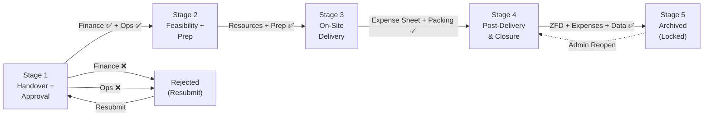

# TreOps Flow — Complete Project Analysis

> **Internal Operations Workflow Management System for Trebound**
> An end-to-end program lifecycle management platform built to streamline Trebound's corporate event/activity delivery pipeline from Sales handover through final closure.

---

## Table of Contents

1. [Project Overview](#project-overview)
2. [Technology Stack](#technology-stack)
3. [Architecture & Project Structure](#architecture--project-structure)
4. [Database Schema](#database-schema)
5. [Authentication & Authorization](#authentication--authorization)
6. [The 5-Stage Workflow Pipeline](#the-5-stage-workflow-pipeline)
7. [Features Breakdown](#features-breakdown)
8. [Server Actions (Business Logic)](#server-actions-business-logic)
9. [Email Notification System](#email-notification-system)
10. [File Upload System](#file-upload-system)
11. [UI Components](#ui-components)
12. [Dashboard Pages & Routes](#dashboard-pages--routes)
13. [Validation System](#validation-system)
14. [Deployment & Configuration](#deployment--configuration)
15. [Current Implementation Status](#current-implementation-status)

---

## Project Overview

**TreOps Flow** (package name: `trebound-workflow`) is an internal web application built for **Trebound**, a corporate team-building and outbound learning company. The system manages the complete lifecycle of corporate programs/events — from the moment a sales team creates a program card, through finance approval, operational preparation, on-site delivery, post-delivery closure, and final archival.

### What Problem It Solves

Trebound runs corporate programs (team-building activities, outbound learning events, virtual workshops, etc.) that involve multiple departments — **Sales**, **Operations**, **Finance**, and **Admin**. This tool digitizes and enforces the workflow between these teams, ensuring:

- **No program slips through the cracks** — every program follows a mandatory 5-stage pipeline
- **Accountability at every gate** — stage transitions require specific exit criteria to be met
- **Finance oversight** — budget must be approved before operations can begin
- **Complete audit trail** — every stage transition is logged with who, when, and why
- **Automated notifications** — stakeholders receive emails at every milestone

---

## Technology Stack

| Layer | Technology | Version |
|---|---|---|
| **Framework** | Next.js (App Router) | 16.1.1 |
| **Language** | TypeScript | 5.9.3 |
| **UI Library** | React | 19.2.3 |
| **Styling** | Tailwind CSS | v4 |
| **Component Library** | Radix UI (shadcn/ui pattern) | Various |
| **ORM** | Prisma | 6.19.1 |
| **Database** | PostgreSQL | Production DB |
| **Authentication** | NextAuth v5 (Auth.js beta 30) | Credentials provider |
| **Email** | Nodemailer (SMTP/Gmail) | 7.0.12 |
| **File Storage** | ImageKit (@imagekit/nodejs v7) | Cloud CDN |
| **Form Handling** | React Hook Form + Zod | 7.70.0 / 4.3.5 |
| **Drag & Drop** | @dnd-kit/core + sortable | 6.3.1 |
| **Date Utilities** | date-fns | 4.1.0 |
| **Icons** | Lucide React | 0.562.0 |
| **Font** | Geist (via `next/font`) | — |
| **Password Hashing** | bcryptjs | 3.0.3 |
| **Hosting** | Netlify (with `@netlify/plugin-nextjs`) | — |

---

## Architecture & Project Structure

```
d:\TreOps\TreOpsFlow\
├── prisma/
│   ├── schema.prisma          # Database schema (3 models)
│   ├── migrations/            # DB migration history
│   ├── seed.ts / seed.js      # Database seeding scripts
│   └── dev.db                 # Local SQLite dev database
├── public/
│   └── logo.png, *.svg        # Static assets
├── src/
│   ├── auth.ts                # NextAuth configuration (Credentials provider)
│   ├── middleware.ts           # Route protection middleware
│   ├── app/
│   │   ├── layout.tsx          # Root layout (Geist fonts + Toaster)
│   │   ├── page.tsx            # Home page (default Next.js boilerplate)
│   │   ├── globals.css         # Global styles
│   │   ├── login/
│   │   │   └── page.tsx        # Login page (client component)
│   │   ├── api/
│   │   │   └── auth/           # NextAuth API route handlers
│   │   ├── actions/            # 10 Server Actions (core business logic)
│   │   │   ├── program.ts      # CRUD for ProgramCard
│   │   │   ├── stage1.ts       # Stage 1 create/update + emails
│   │   │   ├── stage2.ts       # Stage 2 update + move to Stage 3
│   │   │   ├── stage3.ts       # Stage 3 update + move to Stage 4
│   │   │   ├── stage4.ts       # Stage 4 update + move to Stage 5
│   │   │   ├── stage5.ts       # Reopen closed programs (Admin only)
│   │   │   ├── approval.ts     # Finance approval + Ops handover
│   │   │   ├── rejection.ts    # Finance/Ops rejection + resubmission
│   │   │   ├── admin.ts        # User management + dashboard stats
│   │   │   └── upload.ts       # File upload to ImageKit
│   │   └── dashboard/
│   │       ├── layout.tsx       # Dashboard sidebar + navigation
│   │       ├── page.tsx         # Main dashboard (programs list/board)
│   │       ├── programs/
│   │       │   ├── page.tsx     # All Programs (re-exports dashboard)
│   │       │   ├── new/page.tsx # New Program form
│   │       │   └── [id]/page.tsx # Program detail (stage forms)
│   │       ├── pending-approvals/page.tsx  # Finance/Ops review queue
│   │       ├── reports/page.tsx            # Analytics dashboard
│   │       ├── settings/page.tsx           # User profile view
│   │       └── team/
│   │           ├── page.tsx     # Team management (Admin only)
│   │           └── add-user-form.tsx
│   ├── components/
│   │   ├── ui/                 # 22 shadcn/ui base components
│   │   ├── forms/              # 6 stage-specific form components
│   │   │   ├── program-form.tsx
│   │   │   ├── stage1-form.tsx  (47KB — most complex)
│   │   │   ├── stage2-form.tsx
│   │   │   ├── stage3-form.tsx
│   │   │   ├── stage4-form.tsx
│   │   │   └── stage5-view.tsx  (read-only archive view)
│   │   ├── dashboard/          # Dashboard-specific components
│   │   │   ├── dashboard-view.tsx      # List/Board toggle view
│   │   │   ├── kanban-board.tsx        # Drag-and-drop Kanban
│   │   │   ├── kanban-column.tsx
│   │   │   ├── kanban-card.tsx
│   │   │   ├── stage-transition-modal.tsx
│   │   │   └── stage1-summary.tsx
│   │   ├── handover-actions.tsx        # Finance/Ops action buttons
│   │   ├── program-details.tsx         # Program detail display
│   │   └── rejection-feedback.tsx      # Rejection reason display
│   └── lib/
│       ├── prisma.ts           # Prisma client singleton
│       ├── email.ts            # SMTP transporter + sendEmail()
│       ├── email-templates.ts  # 10 HTML email templates
│       ├── imagekit.ts         # ImageKit upload/delete/URL utils
│       ├── validations.ts      # All validation rules + stage exit criteria
│       └── utils.ts            # cn() utility (clsx + tailwind-merge)
├── .env / .env.example         # Environment configuration
├── netlify.toml                # Netlify deployment config
├── next.config.ts              # Next.js configuration
└── trebound-workflow-documentation.md  # Original workflow spec document
```

---

## Database Schema

The database uses **PostgreSQL** via Prisma ORM with **3 models**:

### 1. [User](file:///d:/TreOps/TreOpsFlow/src/app/actions/admin.ts#11-19)

| Field | Type | Description |
|---|---|---|
| [id](file:///d:/TreOps/TreOpsFlow/src/middleware.ts#4-30) | UUID | Primary key |
| `name` | String | Full name |
| `email` | String (unique) | Login email |
| `phone` | String? | Optional phone |
| `role` | String | `"Sales"`, `"Ops"`, `"Finance"`, or `"Admin"` |
| `password` | String | bcrypt-hashed |
| `active` | Boolean | Default `true` |

**Relations:** Owns programs as Sales POC, Ops SPOC, or Rejector.

### 2. `ProgramCard`

The core entity — a single flat table with **~70 fields** spanning all 5 stages:

| Stage | Key Fields |
|---|---|
| **Stage 1 (Handover)** | `programName`, `programType`, `programDates`, `location`, `minPax`/`maxPax`, `salesPOCId`, `clientPOCName`/[Phone](file:///d:/TreOps/TreOpsFlow/src/lib/validations.ts#12-17)/[Email](file:///d:/TreOps/TreOpsFlow/src/lib/email.ts#26-55), `companyName`, `activityType`, `objectives`, `deliveryBudget`, `agendaDocument`, `financeApprovalReceived`, `handoverAcceptedByOps`, `opsSPOCId` |
| **Rejection** | `rejectionStatus` (`rejected_finance` / `rejected_ops`), `financeRejectionReason`, `opsRejectionReason`, `rejectedBy`, `rejectedAt`, `resubmissionCount` |
| **Stage 2 (Preps)** | `facilitatorsBlocked`, `helperStaffBlocked`, `transportBlocked`, `agendaWalkthroughDone`, `logisticsListLocked`, `allResourcesBlocked`, `prepComplete` |
| **Stage 3 (Delivery)** | `venueReached`, `facilitatorsReached`, `programCompleted`, `tripExpenseSheet`, `packingCheckDone`, `actualParticipantCount`, `medicalIssues` |
| **Stage 4 (Closure)** | `npsScore`, `clientFeedback`, `finalInvoiceSubmitted`, `vendorPaymentsClear`, `googleReviewLink`, `zfdRating`, `zfdComments`, `expensesBillsSubmitted`, `opsDataManagerUpdated` |
| **Stage 5 (Archived)** | `closedAt`, `closedBy`, `finalNotes`, `locked` |

### 3. `StageTransition`

Audit trail for every stage change:

| Field | Description |
|---|---|
| `fromStage` / `toStage` | The transition direction |
| `transitionedAt` | Timestamp |
| `transitionedBy` | User who triggered it |
| `approvalNotes` | Optional notes |

---

## Authentication & Authorization

### Authentication Flow

- **Provider**: NextAuth v5 (Auth.js) with **Credentials** provider only
- **Login**: Email + password validated against the [User](file:///d:/TreOps/TreOpsFlow/src/app/actions/admin.ts#11-19) table, password compared with bcrypt
- **Session**: JWT-based — `role` and [id](file:///d:/TreOps/TreOpsFlow/src/middleware.ts#4-30) are injected into the token/session via callbacks
- **Custom login page** at `/login`

### Route Protection

The [middleware.ts](file:///d:/TreOps/TreOpsFlow/src/middleware.ts) enforces:

| Route | Behavior |
|---|---|
| `/` (root) | Redirects to `/dashboard` if logged in, else to `/login` |
| `/dashboard/**` | Requires authentication — redirects to `/login` if no session |
| `/login` | Redirects to `/dashboard` if already logged in |
| API/static routes | Pass through (excluded via matcher) |

### Role-Based Access Control (RBAC)

| Capability | Sales | Ops | Finance | Admin |
|---|---|---|---|---|
| Create Program | ✅ | ❌ | ❌ | ✅ |
| Edit Stage 1 | ✅ | ❌ | ❌ | ✅ |
| Approve Finance | ❌ | ❌ | ✅ | ✅ |
| Accept/Reject Handover | ❌ | ✅ | ❌ | ✅ |
| Edit Stages 2–4 | ❌ | ✅ | ❌ | ✅ |
| View Programs | ✅ | ✅ | ✅ | ✅ |
| Reopen Closed Programs | ❌ | ❌ | ❌ | ✅ |
| Manage Team | ❌ | ❌ | ❌ | ✅ |
| See Pending Approvals | ❌ | ✅ | ✅ | ✅ |

---

## The 5-Stage Workflow Pipeline



### Stage 1 — Handover + Approval

- **Owner**: Sales (creates) → Finance (approves budget) → Ops (accepts handover)
- **Sales creates** a program card with all details: client info, dates, location, pax, budget, activity type, objectives, agenda document
- **Finance reviews** budget and either approves or rejects (with mandatory reason)
- **Ops reviews** the handover and either accepts or rejects (with mandatory reason)
- **Exit Criteria**: Ops SPOC assigned, Finance approved, Ops accepted, Agenda document uploaded
- **On rejection**: Sales can edit and resubmit; rejection counter is tracked

### Stage 2 — Feasibility + Program Preparation

- **Owner**: Operations Team
- Ops blocks resources (facilitators, helpers, transport), confirms logistics, finalizes agenda
- Upload logistics list, travel plan, and Stage 2 agenda documents
- **Exit Criteria**: All resources blocked, logistics list locked, prep marked complete, at least 1 facilitator assigned

### Stage 3 — On-Site Delivery

- **Owner**: On-ground Ops/Facilitator team
- Track venue arrival, facilitator arrival, program execution
- Document participant count, medical issues, delivery notes
- Upload trip expense sheet (mandatory) and complete packing checklist
- **Exit Criteria**: Trip expense sheet uploaded, packing checklist done

### Stage 4 — Post-Delivery & Closure

- **Owner**: Operations + Finance
- Collect client feedback (NPS, Google review, video testimonial)
- Submit expenses/bills, update Ops Data Manager
- Fill **ZFD (Zero Fault Delivery)** rating (1–5, mandatory comments if ≤ 3)
- **Exit Criteria**: ZFD rating filled, expenses submitted, Ops data updated

### Stage 5 — Archived (Done)

- Program is **locked** (read-only), `closedAt` and `closedBy` recorded
- All data preserved for reporting and audits
- **Only Admin** can reopen (returns to Stage 4) with mandatory justification (min 10 chars)
- Reopening appends to `finalNotes` with timestamp and reason

---

## Features Breakdown

### 1. Dual-View Dashboard

- **List View**: Tabular display of all programs with Program ID, Name, Date, Stage badge, Sales Owner, and a "View" action link
- **Board View (Kanban)**: 5-column drag-and-drop board using `@dnd-kit/core` where each column represents a stage
- Toggle between views using tabs (List / Board icons)
- "New Program" button visible only to Sales/Admin roles

### 2. Kanban Board with Drag & Drop

- Programs appear as cards in stage columns
- Dragging a card to a new column opens a **Stage Transition Modal** for confirmation
- Optimistic UI updates with server-side rollback on failure
- Uses pointer and keyboard sensors with 5px activation threshold

### 3. Comprehensive Stage Forms

- **Stage 1 Form** ([stage1-form.tsx](file:///d:/TreOps/TreOpsFlow/src/components/forms/stage1-form.tsx), 47KB): The most complex form — multi-section with basic info, client details, activity info, budget, logistics, and file uploads
- **Stage 2 Form**: Resource blocking, logistics, agenda walkthrough, prep status
- **Stage 3 Form**: Delivery checklist, participant tracking, expense sheets
- **Stage 4 Form**: Feedback collection, financial closure, ZFD rating
- **Stage 5 View**: Read-only archive view of all program data

### 4. Finance Approval & Rejection Workflow

- Programs in Stage 1 appear in the **Pending Approvals** page for Finance users
- Finance can **Approve** (enables Ops handover) or **Reject** (with mandatory reason, min 10 chars)
- Rejected programs display the rejection reason to Sales
- Sales can **Resubmit** after editing — resubmission counter is tracked

### 5. Ops Handover Acceptance & Rejection

- After Finance approval, programs appear in Pending Approvals for Ops users
- Ops can **Accept Handover** (auto-assigns themselves as SPOC, moves to Stage 2) or **Reject** (with reason)
- On acceptance, a `StageTransition` audit record is created

### 6. Email Notification System

- **10 distinct email templates** with branded HTML (gradient header, Trebound branding)
- Emails sent at every major workflow event (see [Email Notification System](#email-notification-system))
- Non-blocking — email failures don't halt workflow operations

### 7. File Upload to ImageKit CDN

- Server action accepts `FormData`, validates file size (≤10MB) and type
- **Documents**: PDF, DOC, DOCX, XLS, XLSX
- **Media**: JPG, PNG, MP4, MOV, AVI, WMV, WEBM
- Uploads to ImageKit cloud with unique filenames, returns CDN URL

### 8. Team Management (Admin Only)

- View all users in a table with name, email, role badge, and join date
- Add new users via a dialog form (name, email, password, role selector)
- Passwords are bcrypt-hashed before storage

### 9. Reports & Analytics Dashboard

- **4 metric cards**: Pipeline Revenue (₹), Active Programs, Completed Programs, Total Programs
- Placeholder areas for charts (revenue over time, recent activity)
- Data fetched via [getDashboardStats()](file:///d:/TreOps/TreOpsFlow/src/app/actions/admin.ts#61-86) server action using Prisma aggregation

### 10. User Settings Page

- Read-only display of current user's name, email, and role
- Placeholder for future system-wide settings (Admin only)

### 11. Program Reopening (Admin)

- Admin can reopen archived (Stage 5) programs
- Requires justification (min 10 chars)
- Returns program to Stage 4, unlocks editing
- Creates audit trail entry
- Sends reopening notification emails to Sales/Ops owners

---

## Server Actions (Business Logic)

All business logic is implemented as Next.js **Server Actions** (`'use server'`):

| File | Functions | Purpose |
|---|---|---|
| [program.ts](file:///d:/TreOps/TreOpsFlow/src/app/actions/program.ts) | [createProgram()](file:///d:/TreOps/TreOpsFlow/src/app/actions/program.ts#26-68), [getPrograms()](file:///d:/TreOps/TreOpsFlow/src/app/actions/program.ts#69-86), [getProgramById()](file:///d:/TreOps/TreOpsFlow/src/app/actions/program.ts#87-99), [updateProgramStage()](file:///d:/TreOps/TreOpsFlow/src/app/actions/program.ts#100-117) | CRUD operations for ProgramCard |
| [stage1.ts](file:///d:/TreOps/TreOpsFlow/src/app/actions/stage1.ts) | [createProgram()](file:///d:/TreOps/TreOpsFlow/src/app/actions/program.ts#26-68), [updateStage1()](file:///d:/TreOps/TreOpsFlow/src/app/actions/stage1.ts#125-185) | Stage 1 creation with email notifications, field updates |
| [stage2.ts](file:///d:/TreOps/TreOpsFlow/src/app/actions/stage2.ts) | [updateProgram()](file:///d:/TreOps/TreOpsFlow/src/app/actions/stage2.ts#25-56), [moveToStage3()](file:///d:/TreOps/TreOpsFlow/src/app/actions/stage2.ts#57-131) | Stage 2 field updates, validated transition to Stage 3 |
| [stage3.ts](file:///d:/TreOps/TreOpsFlow/src/app/actions/stage3.ts) | [updateStage3()](file:///d:/TreOps/TreOpsFlow/src/app/actions/stage3.ts#21-52), [moveToStage4()](file:///d:/TreOps/TreOpsFlow/src/app/actions/stage3.ts#53-126) | Delivery tracking, validated transition to Stage 4 |
| [stage4.ts](file:///d:/TreOps/TreOpsFlow/src/app/actions/stage4.ts) | [updateStage4()](file:///d:/TreOps/TreOpsFlow/src/app/actions/stage4.ts#10-39), [moveToStage5()](file:///d:/TreOps/TreOpsFlow/src/app/actions/stage4.ts#40-135) | Post-delivery updates, validated program closure |
| [stage5.ts](file:///d:/TreOps/TreOpsFlow/src/app/actions/stage5.ts) | [reopenProgram()](file:///d:/TreOps/TreOpsFlow/src/app/actions/stage5.ts#8-108) | Admin-only: reopen archived programs back to Stage 4 |
| [approval.ts](file:///d:/TreOps/TreOpsFlow/src/app/actions/approval.ts) | [approveFinance()](file:///d:/TreOps/TreOpsFlow/src/app/actions/approval.ts#10-72), [acceptHandover()](file:///d:/TreOps/TreOpsFlow/src/app/actions/approval.ts#73-141), [moveToStage2()](file:///d:/TreOps/TreOpsFlow/src/app/actions/approval.ts#142-190) | Finance budget approval, Ops handover with validation |
| [rejection.ts](file:///d:/TreOps/TreOpsFlow/src/app/actions/rejection.ts) | [rejectFinance()](file:///d:/TreOps/TreOpsFlow/src/app/actions/rejection.ts#9-65), [rejectOpsHandover()](file:///d:/TreOps/TreOpsFlow/src/app/actions/rejection.ts#66-122), [resubmitProgram()](file:///d:/TreOps/TreOpsFlow/src/app/actions/rejection.ts#123-215), [getPendingApprovals()](file:///d:/TreOps/TreOpsFlow/src/app/actions/rejection.ts#216-279) | Rejection workflows with email notifications |
| [admin.ts](file:///d:/TreOps/TreOpsFlow/src/app/actions/admin.ts) | [getUsers()](file:///d:/TreOps/TreOpsFlow/src/app/actions/admin.ts#11-19), [createUser()](file:///d:/TreOps/TreOpsFlow/src/app/actions/admin.ts#27-57), [getDashboardStats()](file:///d:/TreOps/TreOpsFlow/src/app/actions/admin.ts#61-86) | User CRUD, analytics aggregation |
| [upload.ts](file:///d:/TreOps/TreOpsFlow/src/app/actions/upload.ts) | [uploadFile()](file:///d:/TreOps/TreOpsFlow/src/app/actions/upload.ts#7-53), [getUploadAuth()](file:///d:/TreOps/TreOpsFlow/src/app/actions/upload.ts#54-65) | ImageKit file upload with validation |

---

## Email Notification System

Built with **Nodemailer** via SMTP (Gmail), 10 branded HTML templates:

| # | Event | Template | Recipients |
|---|---|---|---|
| 1 | Program Created | [programCreatedEmail](file:///d:/TreOps/TreOpsFlow/src/lib/email-templates.ts#45-81) | Sales Owner |
| 2 | Finance Approval Needed | [financeApprovalRequestedEmail](file:///d:/TreOps/TreOpsFlow/src/lib/email-templates.ts#82-115) | Finance + Admin team |
| 3 | Budget Approved | [budgetApprovedEmail](file:///d:/TreOps/TreOpsFlow/src/lib/email-templates.ts#116-146) | Sales Owner |
| 4 | Handover Ready for Ops | [opsHandoverReadyEmail](file:///d:/TreOps/TreOpsFlow/src/lib/email-templates.ts#147-182) | Ops + Admin team |
| 5 | Handover to Ops | [handoverToOpsEmail](file:///d:/TreOps/TreOpsFlow/src/lib/email-templates.ts#183-217) | Assigned Ops SPOC |
| 6 | Stage Completed | [stageCompletedEmail](file:///d:/TreOps/TreOpsFlow/src/lib/email-templates.ts#218-257) | Ops Owner |
| 7 | Program Closed | [programClosedEmail](file:///d:/TreOps/TreOpsFlow/src/lib/email-templates.ts#258-291) | Sales + Ops + Finance teams |
| 8 | Finance Rejection | [financeRejectedEmail](file:///d:/TreOps/TreOpsFlow/src/lib/email-templates.ts#292-333) | Sales Owner |
| 9 | Ops Rejection | [opsRejectedEmail](file:///d:/TreOps/TreOpsFlow/src/lib/email-templates.ts#334-376) | Sales Owner |
| 10 | Program Resubmitted | [programResubmittedEmail](file:///d:/TreOps/TreOpsFlow/src/lib/email-templates.ts#377-410) | Finance or Ops team |
| 11 | Program Reopened | [programReopenedEmail](file:///d:/TreOps/TreOpsFlow/src/lib/email-templates.ts#411-458) | Sales + Ops owners |

All emails use a consistent branded template with:
- Gradient header (`#0b1221` → `#1a2332`) with Trebound logo
- Orange (`#F26522`) CTA buttons linking to the program detail page
- Info boxes with program details
- Footer with copyright notice

---

## File Upload System

### Flow
1. Client selects file → FormData sent to [uploadFile()](file:///d:/TreOps/TreOpsFlow/src/app/actions/upload.ts#7-53) server action
2. Server validates: authentication, file size (≤10MB), file type
3. Buffer converted to base64 → uploaded to ImageKit CDN
4. Returns `{ url, fileId }` — URL stored in the ProgramCard record

### Capabilities
- **Upload**: [uploadToImageKit()](file:///d:/TreOps/TreOpsFlow/src/lib/imagekit.ts#29-87) — base64 upload with unique filenames
- **Delete**: [deleteFromImageKit()](file:///d:/TreOps/TreOpsFlow/src/lib/imagekit.ts#88-105) — cleanup by fileId
- **Transform**: [getImageKitURL()](file:///d:/TreOps/TreOpsFlow/src/lib/imagekit.ts#106-137) — on-the-fly width/height/quality transforms

---

## UI Components

### Base UI (22 shadcn/ui components)

`alert`, `badge`, `button`, `calendar`, `card`, `checkbox`, `combobox`, `command`, `dialog`, `file-upload`, `form`, `input`, `label`, `popover`, `rejection-modal`, `scroll-area`, `select`, `separator`, `table`, `tabs`, `textarea`, `toaster`

### Domain Components

| Component | Purpose |
|---|---|
| [dashboard-view.tsx](file:///d:/TreOps/TreOpsFlow/src/components/dashboard/dashboard-view.tsx) | List/Board toggle with data table |
| [kanban-board.tsx](file:///d:/TreOps/TreOpsFlow/src/components/dashboard/kanban-board.tsx) | DnD context with stage columns |
| [kanban-column.tsx](file:///d:/TreOps/TreOpsFlow/src/components/dashboard/kanban-column.tsx) | Individual stage column |
| [kanban-card.tsx](file:///d:/TreOps/TreOpsFlow/src/components/dashboard/kanban-card.tsx) | Draggable program card |
| [stage-transition-modal.tsx](file:///d:/TreOps/TreOpsFlow/src/components/dashboard/stage-transition-modal.tsx) | Confirm stage change dialog |
| [stage1-summary.tsx](file:///d:/TreOps/TreOpsFlow/src/components/dashboard/stage1-summary.tsx) | Stage 1 data summary display |
| [handover-actions.tsx](file:///d:/TreOps/TreOpsFlow/src/components/handover-actions.tsx) | Finance approve/reject + Ops accept/reject buttons |
| [program-details.tsx](file:///d:/TreOps/TreOpsFlow/src/components/program-details.tsx) | Program info display card |
| [rejection-feedback.tsx](file:///d:/TreOps/TreOpsFlow/src/components/rejection-feedback.tsx) | Rejection reason display with resubmit option |

---

## Dashboard Pages & Routes

| Route | Access | Description |
|---|---|---|
| `/login` | Public | Email + password login form |
| `/dashboard` | All authenticated | Main dashboard with List/Board view of all programs |
| `/dashboard/programs` | All authenticated | Same as dashboard (re-exports) |
| `/dashboard/programs/new` | Sales, Admin | New program creation form |
| `/dashboard/programs/[id]` | All authenticated | Program detail with stage-specific form |
| `/dashboard/pending-approvals` | Finance, Ops, Admin | Queue of programs awaiting review |
| `/dashboard/reports` | All authenticated | Analytics cards (revenue, active, completed, total) |
| `/dashboard/settings` | All authenticated | User profile info (read-only) |
| `/dashboard/team` | Admin only | User management table + add user |

---

## Validation System

Centralized in [validations.ts](file:///d:/TreOps/TreOpsFlow/src/lib/validations.ts):

### Field-Level Validations
- **Email**: Standard regex validation
- **Phone**: Indian format (10 digits starting with 6–9)
- **Dates**: No past dates allowed
- **Pax**: minPax > 0 and minPax ≤ maxPax
- **Budget**: Must be positive
- **File Size**: ≤ 10MB
- **Documents**: PDF, DOC, DOCX, XLS, XLSX only
- **Media**: JPG, PNG, MP4, MOV, AVI, WMV, WEBM only
- **ZFD Rating**: 1–5 scale; comments mandatory if ≤ 3 (min 10 chars)

### Stage Exit Criteria (Gate Validations)

| Transition | Mandatory Criteria |
|---|---|
| **Stage 1 → 2** | Ops SPOC assigned, Finance approved, Ops accepted, Agenda uploaded |
| **Stage 2 → 3** | All resources blocked, Logistics locked, Prep complete, ≥1 facilitator |
| **Stage 3 → 4** | Trip expense sheet uploaded, Packing checklist done |
| **Stage 4 → 5** | ZFD rating (1-5), Expenses submitted, Ops data updated |

Each validation returns a `{ isValid: boolean, errors: string[] }` result used by the stage transition actions.

---

## Deployment & Configuration

### Environment Variables

| Variable | Purpose |
|---|---|
| `DATABASE_URL` | PostgreSQL connection string |
| `NEXTAUTH_SECRET` | JWT signing secret |
| `NEXTAUTH_URL` | App base URL |
| `NEXT_PUBLIC_IMAGEKIT_PUBLIC_KEY` | ImageKit public key |
| `IMAGEKIT_PRIVATE_KEY` | ImageKit server-side key |
| `NEXT_PUBLIC_IMAGEKIT_URL_ENDPOINT` | ImageKit CDN URL |
| `SMTP_HOST` / `SMTP_PORT` | SMTP server config (default: Gmail) |
| `SMTP_USER` / `SMTP_PASSWORD` | SMTP credentials |
| `SMTP_FROM` | Sender email address |
| `NEXT_PUBLIC_APP_URL` | Used in email template links |

### Hosting
- Deployed on **Netlify** with `@netlify/plugin-nextjs`
- [netlify.toml](file:///d:/TreOps/TreOpsFlow/netlify.toml) configured for Next.js builds

---

## Current Implementation Status

### ✅ Fully Implemented

| Feature | Status |
|---|---|
| Authentication (login/logout, session, middleware) | ✅ Complete |
| Role-based access control (4 roles) | ✅ Complete |
| 5-stage workflow pipeline | ✅ Complete |
| Stage 1 form (program creation + edit) | ✅ Complete |
| Stage 2–4 forms (update + transitions) | ✅ Complete |
| Stage 5 read-only view | ✅ Complete |
| Finance approval + rejection | ✅ Complete |
| Ops handover acceptance + rejection | ✅ Complete |
| Program resubmission flow | ✅ Complete |
| Kanban board with drag-and-drop | ✅ Complete |
| Stage transition modals | ✅ Complete |
| Email notifications (10+ templates) | ✅ Complete |
| File upload to ImageKit CDN | ✅ Complete |
| Pending approvals dashboard | ✅ Complete |
| Team management (Admin) | ✅ Complete |
| Reports page (4 metric cards) | ✅ Complete |
| Settings page (profile view) | ✅ Complete |
| Validation system (field + gate) | ✅ Complete |
| Program reopening (Admin) | ✅ Complete |
| Database seeding scripts | ✅ Complete |
| Audit trail (StageTransition model) | ✅ Complete |
| Netlify deployment configuration | ✅ Complete |

### ⚠️ Partially Implemented / Placeholder

| Feature | Status |
|---|---|
| Reports — charts/graphs | 🔲 Placeholder UI only (no charting library) |
| Reports — recent activity feed | 🔲 Hardcoded sample data |
| Revenue growth percentage | 🔲 Static "+20.1%" text |
| Application-wide settings | 🔲 Placeholder text only |
| Root page (`/`) | 🔲 Default Next.js boilerplate (not used) |
| App metadata (title/description) | 🔲 Default "Create Next App" text |

### 🔲 Not Yet Implemented (per original spec)

| Feature from Spec | Status |
|---|---|
| SMS notifications | ❌ Not implemented |
| Auto-logistics list generation | ❌ Not implemented |
| Auto-progression timers (Stage 3→4 after 2h) | ❌ Not implemented |
| Export functionality (Excel, PDF) | ❌ Not implemented |
| Delivery day reminder (1 day before) | ❌ Not implemented |
| Expense sheet overdue alerts | ❌ Not implemented |
| Low ZFD rating alert routing | ❌ Not implemented |
| Revenue by program type breakdown | ❌ Not implemented |
| Facilitator workload reports | ❌ Not implemented |
| Equipment/transport tracking reports | ❌ Not implemented |
| Card deletion (Admin) | ❌ Not implemented |
| Mobile-responsive delivery checklist | ❌ Not explicitly done |
| Program date validation (no past dates) | ⚠️ Defined in validations but not enforced in forms |

---

> **Document generated**: March 11, 2026
> **Source**: In-depth analysis of all source files in `d:\TreOps\TreOpsFlow\`
